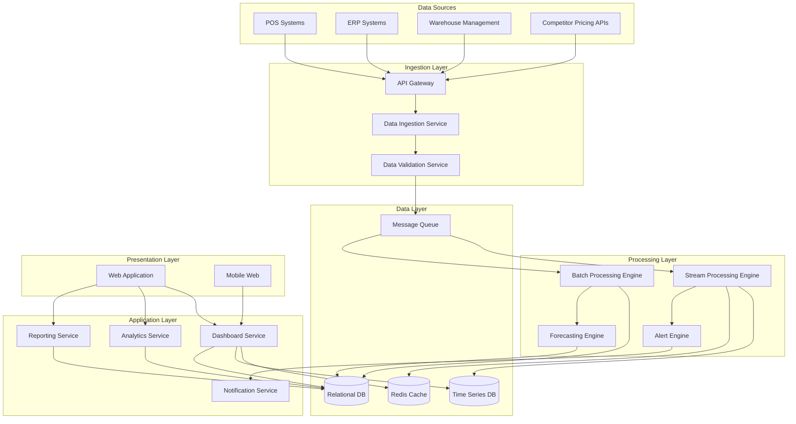

# Design Document: Bharat Retail Market Intelligence Platform

## Overview

The Bharat Retail Market Intelligence Platform is a cloud-native, microservices-based system designed to provide real-time market intelligence across 10,000+ retail stores. The platform ingests data from multiple sources (POS systems, ERP, warehouse management, competitor pricing services), processes it in real-time, and presents actionable insights through role-based dashboards with automated alerting.

### Key Design Principles

1. **Real-time First**: Sub-5-second latency from data ingestion to dashboard updates
2. **Scalability**: Horizontal scaling to support 10,000+ stores and 1,000+ concurrent users
3. **Modularity**: Loosely coupled microservices for independent scaling and deployment
4. **Security by Design**: Role-based access control, encryption, and comprehensive audit logging
5. **Resilience**: Fault tolerance, graceful degradation, and disaster recovery capabilities
6. **Cloud-Native**: Containerized services deployable on AWS, Azure, or GCP

## Architecture

### High-Level Architecture

The platform follows a layered microservices architecture with event-driven communication:



### Architecture Layers

#### 1. Data Ingestion Layer
- **API Gateway**: Single entry point for all external data sources, handles authentication, rate limiting, and routing
- **Data Ingestion Service**: Receives data from various sources, performs initial validation, and publishes to message queue
- **Data Validation Service**: Validates data schemas, checks for duplicates, handles data quality issues

#### 2. Processing Layer
- **Stream Processing Engine**: Real-time processing of transaction and inventory data using Apache Kafka + Apache Flink or AWS Kinesis
- **Batch Processing Engine**: Scheduled processing for historical analysis, aggregations, and reporting
- **Forecasting Engine**: ML-based demand forecasting using time series models
- **Alert Engine**: Evaluates rules against incoming data and triggers notifications

#### 3. Data Layer
- **Time Series Database**: Stores real-time metrics (InfluxDB or TimescaleDB) for fast dashboard queries
- **Relational Database**: Stores master data, user data, configurations, and historical aggregates (PostgreSQL)
- **Cache Layer**: Redis for session management, frequently accessed data, and real-time counters
- **Message Queue**: Apache Kafka or AWS SQS for asynchronous event processing

#### 4. Application Layer
- **Dashboard Service**: Serves real-time dashboard data with role-based filtering
- **Analytics Service**: Provides advanced analytics, customer insights, and forecasting results
- **Reporting Service**: Generates scheduled reports and handles data exports
- **Notification Service**: Delivers alerts via email, SMS, and WhatsApp

#### 5. Presentation Layer
- **Web Application**: React-based responsive web UI with role-specific views
- **Mobile Web**: Mobile-optimized interface for on-the-go access

## Components and Interfaces

### 1. API Gateway

**Responsibilities:**
- Authentication and authorization
- Rate limiting (1,000 requests/minute per client)
- Request routing to appropriate services
- API versioning
- Request/response logging

**Interfaces:**
```typescript
// REST API for data ingestion
POST /api/v1/transactions
POST /api/v1/inventory
POST /api/v1/competitor-prices

// GraphQL API for flexible querying
POST /api/v1/graphql

// Authentication
POST /api/v1/auth/login
POST /api/v1/auth/refresh
POST /api/v1/auth/logout
```

**Technology:** Kong API Gateway or AWS API Gateway

### 2. Data Ingestion Service

**Responsibilities:**
- Receive data from API Gateway
- Perform initial schema validation
- Enrich data with metadata (timestamp, source)
- Publish validated data to message queue
- Handle ingestion errors and retries

**Data Models:**
```typescript
interface Transaction {
  transactionId: string;
  storeId: string;
  timestamp: Date;
  items: TransactionItem[];
  totalAmount: number;
  customerId?: string;
  source: string;
}

interface TransactionItem {
  sku: string;
  quantity: number;
  unitPrice: number;
  totalPrice: number;
}

interface InventoryUpdate {
  sku: string;
  storeId: string;
  warehouseId?: string;
  quantity: number;
  timestamp: Date;
  source: string;
}

interface CompetitorPrice {
  sku: string;
  competitorId: string;
  price: number;
  timestamp: Date;
  source: string;
}
```

**Technology:** Node.js or Go microservice

### 3. Stream Processing Engine

**Responsibilities:**
- Real-time aggregation of sales metrics
- Real-time inventory level tracking
- Sliding window calculations (hourly, daily metrics)
- Trigger alert evaluation
- Update cache with latest metrics

**Processing Logic:**
```python
# Pseudo-code for stream processing

def process_transaction(transaction):
    # Update real-time metrics
    update_sales_metrics(transaction)
    update_category_metrics(transaction)
    update_store_metrics(transaction)
    
    # Update inventory
    for item in transaction.items:
        decrement_inventory(item.sku, transaction.storeId, item.quantity)
    
    # Check alert conditions
    evaluate_sales_alerts(transaction)
    
    # Update cache
    cache.set(f"store:{transaction.storeId}:latest", transaction)

def process_inventory_update(update):
    # Update inventory levels
    set_inventory_level(update.sku, update.storeId, update.quantity)
    
    # Check thresholds
    evaluate_inventory_alerts(update)
    
    # Update cache
    cache.set(f"inventory:{update.sku}:{update.storeId}", update.quantity)
```

**Technology:** Apache Flink or AWS Kinesis Data Analytics

### 4. Forecasting Engine

**Responsibilities:**
- Train and maintain demand forecasting models
- Generate 7-day and 30-day forecasts
- Detect seasonal patterns and trends
- Calculate forecast accuracy
- Retrain models based on accuracy metrics

**Forecasting Approach:**
```python
# Pseudo-code for forecasting

class DemandForecaster:
    def __init__(self):
        self.models = {}  # SKU -> Model mapping
    
    def train_model(self, sku, historical_data):
        # Use time series decomposition
        trend = extract_trend(historical_data)
        seasonal = extract_seasonal_pattern(historical_data)
        residual = historical_data - trend - seasonal
        
        # Train SARIMA or Prophet model
        model = SARIMA(order=(1,1,1), seasonal_order=(1,1,1,7))
        model.fit(historical_data)
        
        self.models[sku] = model
    
    def generate_forecast(self, sku, horizon_days):
        model = self.models.get(sku)
        if not model:
            return None
        
        forecast = model.predict(steps=horizon_days)
        confidence_interval = model.get_confidence_interval()
        
        return {
            'sku': sku,
            'forecast': forecast,
            'confidence_interval': confidence_interval,
            'generated_at': datetime.now()
        }
    
    def calculate_accuracy(self, sku, forecast, actual):
        # Calculate MAPE (Mean Absolute Percentage Error)
        mape = mean(abs((actual - forecast) / actual)) * 100
        return 100 - mape  # Convert to accuracy percentage
```

**Technology:** Python with scikit-learn, statsmodels, or Prophet library

### 5. Alert Engine

**Responsibilities:**
- Evaluate alert rules against incoming data
- Manage alert thresholds and configurations
- Consolidate duplicate alerts
- Trigger notifications via Notification Service
- Maintain alert history

**Alert Rule Evaluation:**
```python
# Pseudo-code for alert evaluation

class AlertEngine:
    def __init__(self):
        self.rules = load_alert_rules()
    
    def evaluate_inventory_alert(self, inventory_update):
        sku = inventory_update.sku
        store_id = inventory_update.storeId
        quantity = inventory_update.quantity
        
        # Get thresholds for this SKU/store
        thresholds = get_thresholds(sku, store_id)
        
        alerts = []
        
        # Check low stock
        if quantity < thresholds.reorder_threshold:
            alerts.append({
                'type': 'LOW_STOCK',
                'severity': 'HIGH',
                'sku': sku,
                'store_id': store_id,
                'current_quantity': quantity,
                'threshold': thresholds.reorder_threshold,
                'message': f'Low stock alert: {sku} at store {store_id} has only {quantity} units'
            })
        
        # Check overstock
        if quantity > thresholds.overstock_threshold:
            alerts.append({
                'type': 'OVERSTOCK',
                'severity': 'MEDIUM',
                'sku': sku,
                'store_id': store_id,
                'current_quantity': quantity,
                'threshold': thresholds.overstock_threshold,
                'message': f'Overstock alert: {sku} at store {store_id} has {quantity} units'
            })
        
        # Send alerts
        for alert in alerts:
            self.send_alert(alert)
    
    def evaluate_pricing_alert(self, competitor_price):
        our_price = get_our_price(competitor_price.sku)
        price_diff = our_price - competitor_price.price
        
        threshold = get_pricing_threshold(competitor_price.sku)
        
        if price_diff > threshold:
            alert = {
                'type': 'PRICING',
                'severity': 'MEDIUM',
                'sku': competitor_price.sku,
                'our_price': our_price,
                'competitor_price': competitor_price.price,
                'competitor_id': competitor_price.competitorId,
                'price_difference': price_diff,
                'message': f'Pricing alert: Competitor {competitor_price.competitorId} has lower price for {competitor_price.sku}'
            }
            self.send_alert(alert)
    
    def send_alert(self, alert):
        # Check for duplicate alerts in last hour
        if not is_duplicate_alert(alert):
            publish_to_notification_service(alert)
            store_alert_history(alert)
```

**Technology:** Python or Node.js microservice

### 6. Dashboard Service

**Responsibilities:**
- Serve real-time dashboard data
- Apply role-based data filtering
- Aggregate metrics from cache and databases
- Handle dashboard queries efficiently
- Support custom date range filtering

**API Endpoints:**
```typescript
// Dashboard APIs
GET /api/v1/dashboard/sales/realtime
  Query params: storeId?, regionId?, dateRange?
  Response: {
    revenue: number,
    unitsSold: number,
    avgTransactionValue: number,
    periodOverPeriodGrowth: number
  }

GET /api/v1/dashboard/inventory/status
  Query params: storeId?, sku?, warehouseId?
  Response: {
    items: [{
      sku: string,
      location: string,
      quantity: number,
      reorderThreshold: number,
      status: 'OK' | 'LOW' | 'OVERSTOCK'
    }]
  }

GET /api/v1/dashboard/forecasts
  Query params: sku?, storeId?, horizon?
  Response: {
    forecasts: [{
      sku: string,
      storeId: string,
      forecast: number[],
      accuracy: number,
      generatedAt: Date
    }]
  }

GET /api/v1/dashboard/alerts
  Query params: type?, severity?, status?, limit?
  Response: {
    alerts: [{
      id: string,
      type: string,
      severity: string,
      message: string,
      timestamp: Date,
      status: 'NEW' | 'ACKNOWLEDGED' | 'RESOLVED'
    }]
  }
```

**Role-Based Filtering:**
```python
# Pseudo-code for role-based filtering

def get_sales_data(user, filters):
    # Apply role-based restrictions
    if user.role == 'STORE_MANAGER':
        filters['storeId'] = user.assigned_store_id
    elif user.role == 'REGIONAL_MANAGER':
        filters['regionId'] = user.assigned_region_id
    # EXECUTIVE and ADMIN can see all data
    
    # Query data with filters
    data = query_sales_metrics(filters)
    
    return data
```

**Technology:** Node.js with Express or Python with FastAPI

### 7. Notification Service

**Responsibilities:**
- Deliver alerts via multiple channels (email, SMS, WhatsApp)
- Manage user notification preferences
- Handle notification failures and retries
- Generate daily summary reports
- Track notification delivery status

**Notification Channels:**
```python
# Pseudo-code for notification delivery

class NotificationService:
    def __init__(self):
        self.email_client = EmailClient()
        self.sms_client = SMSClient()
        self.whatsapp_client = WhatsAppClient()
    
    def send_alert(self, alert, recipients):
        for recipient in recipients:
            preferences = get_user_preferences(recipient.user_id)
            
            if 'email' in preferences.channels:
                self.send_email(recipient.email, alert)
            
            if 'sms' in preferences.channels:
                self.send_sms(recipient.phone, alert)
            
            if 'whatsapp' in preferences.channels:
                self.send_whatsapp(recipient.phone, alert)
    
    def send_email(self, email, alert):
        subject = f"[{alert.severity}] {alert.type} Alert"
        body = format_alert_email(alert)
        self.email_client.send(email, subject, body)
    
    def send_daily_summary(self, user):
        # Aggregate alerts from last 24 hours
        alerts = get_alerts_for_user(user.id, last_24_hours=True)
        
        # Generate summary
        summary = generate_summary_report(alerts, user)
        
        # Send via preferred channel
        self.send_email(user.email, summary)
```

**Technology:** Python with Celery for async task processing, integrated with SendGrid (email), Twilio (SMS), and WhatsApp Business API

### 8. Analytics Service

**Responsibilities:**
- Customer insights and segmentation
- Market basket analysis
- Product affinity calculations
- Regional behavior analysis
- Custom analytics queries

**Analytics Algorithms:**
```python
# Pseudo-code for analytics

class AnalyticsService:
    def market_basket_analysis(self, min_support=0.01, min_confidence=0.5):
        # Get transaction data
        transactions = get_all_transactions()
        
        # Apply Apriori algorithm
        frequent_itemsets = apriori(transactions, min_support)
        rules = association_rules(frequent_itemsets, min_confidence)
        
        return {
            'frequent_itemsets': frequent_itemsets,
            'association_rules': rules
        }
    
    def calculate_product_affinity(self, sku1, sku2):
        # Count co-occurrences
        co_purchases = count_co_purchases(sku1, sku2)
        total_sku1 = count_purchases(sku1)
        
        # Calculate lift
        affinity_score = co_purchases / total_sku1
        
        return affinity_score
    
    def segment_customers(self):
        # Get customer purchase data
        customers = get_customer_metrics()
        
        # Features: recency, frequency, monetary value
        features = extract_rfm_features(customers)
        
        # Apply K-means clustering
        kmeans = KMeans(n_clusters=5)
        segments = kmeans.fit_predict(features)
        
        return {
            'segments': segments,
            'segment_characteristics': analyze_segments(segments, features)
        }
    
    def analyze_regional_behavior(self):
        # Get sales by region and category
        regional_data = get_sales_by_region_and_category()
        
        # Calculate category preferences by region
        preferences = {}
        for region in regional_data:
            total_sales = sum(region.category_sales.values())
            preferences[region.id] = {
                category: sales / total_sales
                for category, sales in region.category_sales.items()
            }
        
        return preferences
```

**Technology:** Python with pandas, scikit-learn, and mlxtend libraries

## Data Models

### Core Entities

#### Store
```typescript
interface Store {
  id: string;
  name: string;
  regionId: string;
  address: Address;
  tier: 'TIER_1' | 'TIER_2' | 'RURAL';
  status: 'ACTIVE' | 'INACTIVE';
  createdAt: Date;
  updatedAt: Date;
}
```

#### Product
```typescript
interface Product {
  sku: string;
  name: string;
  category: string;
  subcategory: string;
  brand: string;
  unitPrice: number;
  costPrice: number;
  status: 'ACTIVE' | 'DISCONTINUED';
  createdAt: Date;
  updatedAt: Date;
}
```

#### User
```typescript
interface User {
  id: string;
  email: string;
  passwordHash: string;
  firstName: string;
  lastName: string;
  role: 'ADMIN' | 'REGIONAL_MANAGER' | 'STORE_MANAGER' | 'SUPPLY_CHAIN_USER' | 'BUSINESS_ANALYST' | 'EXECUTIVE';
  assignedStoreId?: string;  // For STORE_MANAGER
  assignedRegionId?: string;  // For REGIONAL_MANAGER
  notificationPreferences: NotificationPreferences;
  status: 'ACTIVE' | 'INACTIVE';
  lastLoginAt?: Date;
  createdAt: Date;
  updatedAt: Date;
}

interface NotificationPreferences {
  channels: ('email' | 'sms' | 'whatsapp')[];
  alertTypes: string[];
  dailySummary: boolean;
}
```

#### Alert Configuration
```typescript
interface AlertConfiguration {
  id: string;
  userId: string;
  alertType: 'LOW_STOCK' | 'OVERSTOCK' | 'PRICING' | 'SALES' | 'FORECAST_ACCURACY';
  thresholds: Record<string, number>;
  enabled: boolean;
  createdAt: Date;
  updatedAt: Date;
}
```

#### Inventory Threshold
```typescript
interface InventoryThreshold {
  sku: string;
  storeId: string;
  reorderThreshold: number;
  overstockThreshold: number;
  createdAt: Date;
  updatedAt: Date;
}
```

### Time Series Data Models

#### Sales Metrics (Time Series)
```typescript
interface SalesMetric {
  timestamp: Date;
  storeId: string;
  regionId: string;
  sku: string;
  category: string;
  revenue: number;
  unitsSold: number;
  transactionCount: number;
}
```

#### Inventory Level (Time Series)
```typescript
interface InventoryLevel {
  timestamp: Date;
  sku: string;
  storeId: string;
  warehouseId?: string;
  quantity: number;
}
```

#### Forecast (Time Series)
```typescript
interface Forecast {
  sku: string;
  storeId: string;
  forecastDate: Date;
  predictedDemand: number;
  confidenceLower: number;
  confidenceUpper: number;
  generatedAt: Date;
  accuracy?: number;  // Populated after actual data is available
}
```

### Database Schema Design

**Relational Database (PostgreSQL):**
- Users, Stores, Products, Regions (master data)
- Alert Configurations, Inventory Thresholds (configuration data)
- Alert History (audit data)
- Forecast Accuracy Metrics (aggregated data)

**Time Series Database (TimescaleDB/InfluxDB):**
- Sales Metrics (high-frequency writes, time-based queries)
- Inventory Levels (real-time tracking)
- Forecasts (time-based predictions)

**Cache (Redis):**
- Session data (key: `session:{sessionId}`)
- Real-time counters (key: `store:{storeId}:sales:today`)
- Latest inventory levels (key: `inventory:{sku}:{storeId}`)
- Dashboard aggregates (key: `dashboard:{userId}:cache`, TTL: 60 seconds)

## Correctness Properties

*A property is a characteristic or behavior that should hold true across all valid executions of a system—essentially, a formal statement about what the system should do. Properties serve as the bridge between human-readable specifications and machine-verifiable correctness guarantees.*


### Property 1: Sales Aggregation Correctness
*For any* set of transactions and any aggregation dimension (store, region, category), the sum of individual transaction values should equal the aggregated metric displayed on the dashboard.
**Validates: Requirements 1.2, 1.3, 1.4, 1.8**

### Property 2: Date Range Filtering Accuracy
*For any* date range filter applied by a user, all returned transactions should have timestamps within the specified range, and no transactions within that range should be excluded.
**Validates: Requirements 1.5**

### Property 3: Period-Over-Period Growth Calculation
*For any* sales metric and time period, the growth percentage should equal ((current_period - previous_period) / previous_period) * 100.
**Validates: Requirements 1.9**

### Property 4: Threshold-Based Alert Generation
*For any* metric with a configured threshold (inventory level, forecast accuracy, system load, price difference), when the metric crosses the threshold, an alert should be generated within the system.
**Validates: Requirements 2.1, 2.2, 4.3, 3.9, 8.6**

### Property 5: Inventory Level Accuracy
*For any* SKU at any location, the displayed inventory level should match the sum of all inventory movements (additions minus subtractions) for that SKU at that location.
**Validates: Requirements 2.3, 2.5**

### Property 6: Turnover Ratio Calculation
*For any* SKU and time period, the turnover ratio should equal (units sold in period) / (average inventory level in period).
**Validates: Requirements 2.4**

### Property 7: Configuration Persistence Round-Trip
*For any* user configuration (alert thresholds, reorder thresholds, notification preferences), storing the configuration and then retrieving it should return an equivalent configuration.
**Validates: Requirements 2.6, 6.5, 6.6**

### Property 8: Inventory Movement Audit Trail
*For any* SKU, all inventory changes should be recorded in the movement history, and the sum of movements should equal the current inventory level.
**Validates: Requirements 2.7**

### Property 9: Inventory Aggregation by Category
*For any* product category and location, the aggregated inventory should equal the sum of inventory levels for all SKUs in that category at that location.
**Validates: Requirements 2.8**

### Property 10: Forecast Historical Data Requirement
*For any* generated forecast, the input historical data should span at least 12 months prior to the forecast generation date.
**Validates: Requirements 3.1**

### Property 11: Forecast Generation Completeness
*For any* active SKU and store combination, 7-day and 30-day forecasts should be generated and available, with region-specific variations applied.
**Validates: Requirements 3.4, 3.5, 3.8**

### Property 12: Forecast Accuracy Calculation
*For any* forecast and corresponding actual sales data, the accuracy percentage should equal 100 - (mean absolute percentage error between forecast and actual).
**Validates: Requirements 3.6, 3.7**

### Property 13: Daily Forecast Updates
*For any* SKU, if a forecast exists, it should have a generation timestamp within the last 24 hours.
**Validates: Requirements 3.10**

### Property 14: Price Difference Calculation
*For any* product with competitor pricing data, the price difference should equal (our_price - competitor_price).
**Validates: Requirements 4.2, 4.4**

### Property 15: Price History Tracking
*For any* product and competitor, all price changes should be recorded with timestamps, and the most recent price should match the current displayed price.
**Validates: Requirements 4.6, 4.7**

### Property 16: Stale Data Identification
*For any* competitor pricing data, if the timestamp is older than 24 hours from the current time, it should be marked as stale.
**Validates: Requirements 4.8**

### Property 17: Product Affinity Score Calculation
*For any* pair of products, the affinity score should equal (number of transactions containing both products) / (number of transactions containing the first product).
**Validates: Requirements 5.2**

### Property 18: Regional Behavior Pattern Aggregation
*For any* region and product category, the regional preference should be calculated as (category sales in region) / (total sales in region).
**Validates: Requirements 5.4**

### Property 19: Customer Segment Display Accuracy
*For any* customer segment, the displayed characteristics should match the aggregated metrics of all customers in that segment.
**Validates: Requirements 5.6**

### Property 20: Daily Insights Update
*For any* customer insight metric, it should have a calculation timestamp within the last 24 hours.
**Validates: Requirements 5.7, 3.10**

### Property 21: Product Bundling Recommendations
*For any* product bundling recommendation, all recommended product pairs should have affinity scores above a minimum threshold.
**Validates: Requirements 5.8**

### Property 22: Alert Channel Delivery
*For any* generated alert and user, the alert should be delivered through all channels configured in the user's notification preferences.
**Validates: Requirements 6.1, 6.2, 6.3, 6.4**

### Property 23: Daily Summary Report Generation
*For any* user configured to receive daily summaries, a summary report should be generated and delivered every 24 hours.
**Validates: Requirements 6.7**

### Property 24: Alert History Completeness
*For any* generated alert, it should be stored in the alert history and remain retrievable indefinitely.
**Validates: Requirements 6.8**

### Property 25: Alert Acknowledgment State Management
*For any* alert, when a user acknowledges it and adds notes, the alert status should change to "ACKNOWLEDGED" and the notes should be stored and retrievable.
**Validates: Requirements 6.9**


### Property 26: Alert Consolidation
*For any* alert type and time window of 1 hour, if multiple alerts of the same type are generated, they should be consolidated into a single notification.
**Validates: Requirements 6.10**

### Property 27: Authentication Enforcement
*For any* platform feature or API endpoint, access should be denied if the request does not include valid authentication credentials.
**Validates: Requirements 7.1**

### Property 28: Role Assignment
*For any* user account, it should be assigned to at least one role from the defined set (Admin, Regional_Manager, Store_Manager, Supply_Chain_User, Business_Analyst, Executive).
**Validates: Requirements 7.2**

### Property 29: Role-Based Data Filtering
*For any* user with a role-specific scope (Store_Manager, Regional_Manager), all dashboard queries should return only data within their assigned scope (store or region).
**Validates: Requirements 7.3, 7.4, 7.5**

### Property 30: Admin User Management Operations
*For any* admin user, they should be able to create, modify, and delete user accounts, and assign or modify user roles.
**Validates: Requirements 7.6, 7.7**

### Property 31: Audit Logging Completeness
*For any* critical operation (data access, role changes, API requests), an audit log entry should be created containing user identity, timestamp, operation type, and affected resources.
**Validates: Requirements 7.8, 9.4, 10.7**

### Property 32: Authorization Enforcement and Logging
*For any* user attempting to access data outside their role permissions, the access should be denied and the attempt should be logged in the audit trail.
**Validates: Requirements 7.9**

### Property 33: Session Timeout Enforcement
*For any* user session, if there is no activity for 30 minutes, the session should be terminated and subsequent requests should require re-authentication.
**Validates: Requirements 7.10**

### Property 34: PII Anonymization in Analytics
*For any* customer analytics output, personally identifiable information fields (name, email, phone, address) should be anonymized or excluded.
**Validates: Requirements 9.3**

### Property 35: Audit Log Retention
*For any* audit log entry, it should be retained for at least 7 years from its creation date.
**Validates: Requirements 9.5**

### Property 36: Password Complexity Validation
*For any* password creation or change attempt, passwords that do not meet complexity requirements (minimum 12 characters, mixed case, numbers, special characters) should be rejected.
**Validates: Requirements 9.6**

### Property 37: Account Lockout After Failed Attempts
*For any* user account, after 5 consecutive incorrect password attempts, the account should be locked for 30 minutes.
**Validates: Requirements 9.7**

### Property 38: User Data Export
*For any* user requesting their personal data, the platform should generate an export containing all data associated with that user's account.
**Validates: Requirements 9.10**

### Property 39: API Input Validation
*For any* API request with invalid data format or missing required fields, the platform should reject the request and return a descriptive error message indicating the validation failure.
**Validates: Requirements 10.3**

### Property 40: API Rate Limiting
*For any* API client, if the request rate exceeds 1,000 requests per minute, subsequent requests should be throttled or rejected with a rate limit error.
**Validates: Requirements 10.5**

### Property 41: API Integration Failure Alerting
*For any* API integration failure (connection timeout, authentication failure, data validation error), an alert should be generated and sent to admin users.
**Validates: Requirements 10.8**

### Property 42: Automated Backup Scheduling
*For any* 6-hour period, an automated backup should be created and stored successfully.
**Validates: Requirements 11.1**

### Property 43: Backup Retention Policy
*For any* backup, it should be retained according to its type: daily backups for 30 days, weekly backups for 90 days, monthly backups for 3 years.
**Validates: Requirements 11.2, 11.3, 11.4**

### Property 44: Backup Failure Alerting
*For any* backup operation that fails, an alert should be generated immediately and sent to admin users.
**Validates: Requirements 11.6**

### Property 45: Point-in-Time Recovery Availability
*For any* point in time within the last hour, a recovery point should exist that allows restoration to that time (RPO < 1 hour).
**Validates: Requirements 11.7**

### Property 46: Scheduled Report Generation
*For any* user with a configured report schedule (daily, weekly, monthly), reports should be generated at the scheduled intervals and delivered to the configured email addresses.
**Validates: Requirements 12.5, 12.6**

### Property 47: Custom Report Generation
*For any* custom report request with selected dimensions and metrics, the generated report should contain data aggregated by the specified dimensions and include only the specified metrics.
**Validates: Requirements 12.8**

### Property 48: Report Retention
*For any* exported report, it should be retained and accessible for download for 90 days from its generation date.
**Validates: Requirements 12.9**

### Property 49: Role-Based Export Filtering
*For any* data export request, the exported data should be filtered according to the user's role permissions, excluding data outside their authorized scope.
**Validates: Requirements 12.10**

## Error Handling

### Error Categories

1. **Data Validation Errors**
   - Invalid data format from external systems
   - Missing required fields
   - Data type mismatches
   - Out-of-range values

2. **Integration Errors**
   - API connection failures
   - Authentication failures
   - Rate limit exceeded
   - Timeout errors

3. **Processing Errors**
   - Forecasting model failures
   - Alert rule evaluation errors
   - Aggregation calculation errors
   - Database query failures

4. **User Errors**
   - Invalid login credentials
   - Unauthorized access attempts
   - Invalid filter parameters
   - Malformed API requests

### Error Handling Strategy

```python
# Pseudo-code for error handling

class ErrorHandler:
    def handle_data_validation_error(self, error, data):
        # Log the error with context
        log_error('DATA_VALIDATION', error, data)
        
        # Send to dead letter queue for manual review
        send_to_dlq(data, error)
        
        # Alert if error rate exceeds threshold
        if get_error_rate('DATA_VALIDATION') > 0.05:
            send_alert('High data validation error rate')
        
        # Return descriptive error to client
        return {
            'status': 'error',
            'code': 'VALIDATION_FAILED',
            'message': str(error),
            'field': error.field if hasattr(error, 'field') else None
        }
    
    def handle_integration_error(self, error, integration_name):
        # Log the error
        log_error('INTEGRATION', error, integration_name)
        
        # Implement exponential backoff retry
        retry_with_backoff(integration_name, max_retries=3)
        
        # Alert admins if integration is down
        send_alert(f'Integration failure: {integration_name}')
        
        # Use cached data if available
        if cache_available(integration_name):
            return get_cached_data(integration_name)
        
        # Return graceful degradation response
        return {
            'status': 'degraded',
            'message': f'{integration_name} temporarily unavailable',
            'cached_data_age': get_cache_age(integration_name)
        }
    
    def handle_processing_error(self, error, operation):
        # Log the error with stack trace
        log_error('PROCESSING', error, operation, include_stack_trace=True)
        
        # Alert if critical operation
        if operation in ['forecasting', 'alert_generation']:
            send_alert(f'Critical processing error in {operation}')
        
        # Skip the failed item and continue processing
        mark_as_failed(operation)
        continue_processing()
    
    def handle_user_error(self, error, user, request):
        # Log for security monitoring
        log_security_event(user, request, error)
        
        # Implement rate limiting for repeated errors
        if get_user_error_count(user) > 10:
            temporarily_block_user(user, duration_minutes=5)
        
        # Return user-friendly error message
        return {
            'status': 'error',
            'code': error.code,
            'message': get_user_friendly_message(error)
        }
```

### Graceful Degradation

When components fail, the system should degrade gracefully:

1. **Cache Fallback**: If real-time data is unavailable, serve cached data with staleness indicator
2. **Partial Results**: If some stores/regions are unavailable, show available data with notification
3. **Reduced Functionality**: If forecasting engine fails, show historical trends instead
4. **Alert Prioritization**: During high load, prioritize critical alerts over informational ones

### Circuit Breaker Pattern

```python
# Pseudo-code for circuit breaker

class CircuitBreaker:
    def __init__(self, failure_threshold=5, timeout=60):
        self.failure_count = 0
        self.failure_threshold = failure_threshold
        self.timeout = timeout
        self.state = 'CLOSED'  # CLOSED, OPEN, HALF_OPEN
        self.last_failure_time = None
    
    def call(self, func, *args, **kwargs):
        if self.state == 'OPEN':
            if time.now() - self.last_failure_time > self.timeout:
                self.state = 'HALF_OPEN'
            else:
                raise CircuitBreakerOpenError()
        
        try:
            result = func(*args, **kwargs)
            if self.state == 'HALF_OPEN':
                self.state = 'CLOSED'
                self.failure_count = 0
            return result
        except Exception as e:
            self.failure_count += 1
            self.last_failure_time = time.now()
            
            if self.failure_count >= self.failure_threshold:
                self.state = 'OPEN'
                send_alert('Circuit breaker opened for ' + func.__name__)
            
            raise e
```

## Testing Strategy

### Dual Testing Approach

The platform requires both unit testing and property-based testing for comprehensive coverage:

- **Unit Tests**: Verify specific examples, edge cases, and error conditions
- **Property Tests**: Verify universal properties across all inputs using randomized test data

Both approaches are complementary and necessary. Unit tests catch concrete bugs in specific scenarios, while property tests verify general correctness across a wide range of inputs.

### Property-Based Testing

**Framework Selection**: 
- Python: Use `Hypothesis` library
- TypeScript/JavaScript: Use `fast-check` library
- Go: Use `gopter` library

**Configuration**:
- Minimum 100 iterations per property test (due to randomization)
- Each property test must reference its design document property
- Tag format: `Feature: bharat-retail-market-intelligence, Property {number}: {property_text}`

**Example Property Test**:
```python
# Python with Hypothesis

from hypothesis import given, strategies as st
import pytest

# Feature: bharat-retail-market-intelligence, Property 1: Sales Aggregation Correctness
@given(
    transactions=st.lists(
        st.fixed_dictionaries({
            'store_id': st.text(min_size=1),
            'amount': st.floats(min_value=0, max_value=100000),
            'category': st.sampled_from(['Electronics', 'Clothing', 'Food'])
        }),
        min_size=1,
        max_size=100
    )
)
def test_sales_aggregation_by_store(transactions):
    """
    For any set of transactions, the sum of individual transaction amounts
    should equal the aggregated revenue by store.
    """
    # Calculate expected aggregates
    expected_by_store = {}
    for txn in transactions:
        store_id = txn['store_id']
        expected_by_store[store_id] = expected_by_store.get(store_id, 0) + txn['amount']
    
    # Get actual aggregates from system
    actual_by_store = dashboard_service.get_sales_by_store(transactions)
    
    # Verify aggregation correctness
    assert actual_by_store == expected_by_store

# Feature: bharat-retail-market-intelligence, Property 7: Configuration Persistence Round-Trip
@given(
    threshold_config=st.fixed_dictionaries({
        'sku': st.text(min_size=1),
        'store_id': st.text(min_size=1),
        'reorder_threshold': st.integers(min_value=1, max_value=1000),
        'overstock_threshold': st.integers(min_value=100, max_value=10000)
    })
)
def test_threshold_configuration_round_trip(threshold_config):
    """
    For any threshold configuration, storing it and then retrieving it
    should return an equivalent configuration.
    """
    # Store configuration
    config_id = inventory_service.set_threshold(threshold_config)
    
    # Retrieve configuration
    retrieved_config = inventory_service.get_threshold(
        threshold_config['sku'],
        threshold_config['store_id']
    )
    
    # Verify round-trip
    assert retrieved_config['reorder_threshold'] == threshold_config['reorder_threshold']
    assert retrieved_config['overstock_threshold'] == threshold_config['overstock_threshold']
```

### Unit Testing

**Focus Areas**:
- Specific examples demonstrating correct behavior
- Edge cases (empty data, boundary values, null handling)
- Error conditions and exception handling
- Integration points between components

**Example Unit Tests**:
```python
# Unit tests for specific scenarios

def test_low_stock_alert_generated_when_below_threshold():
    """Test that low stock alert is generated when inventory falls below threshold."""
    # Setup
    sku = 'TEST-SKU-001'
    store_id = 'STORE-001'
    threshold = 10
    inventory_service.set_threshold(sku, store_id, reorder_threshold=threshold)
    
    # Action
    inventory_service.update_inventory(sku, store_id, quantity=5)
    
    # Assert
    alerts = alert_service.get_alerts(type='LOW_STOCK', sku=sku)
    assert len(alerts) == 1
    assert alerts[0]['sku'] == sku
    assert alerts[0]['store_id'] == store_id

def test_empty_transaction_list_returns_zero_metrics():
    """Test edge case: empty transaction list should return zero metrics."""
    # Action
    metrics = dashboard_service.get_sales_metrics(transactions=[])
    
    # Assert
    assert metrics['revenue'] == 0
    assert metrics['units_sold'] == 0
    assert metrics['transaction_count'] == 0

def test_invalid_api_request_returns_descriptive_error():
    """Test that invalid API requests return descriptive error messages."""
    # Action
    response = api_gateway.post('/api/v1/transactions', data={'invalid': 'data'})
    
    # Assert
    assert response.status_code == 400
    assert 'error' in response.json()
    assert 'message' in response.json()
    assert 'required fields' in response.json()['message'].lower()
```

### Integration Testing

**Scope**:
- End-to-end data flow from ingestion to dashboard
- API authentication and authorization
- Alert generation and notification delivery
- Backup and restore procedures

**Example Integration Test**:
```python
def test_end_to_end_transaction_processing():
    """Test complete flow from transaction ingestion to dashboard update."""
    # Setup
    store_id = 'STORE-001'
    transaction = {
        'transaction_id': 'TXN-001',
        'store_id': store_id,
        'items': [{'sku': 'SKU-001', 'quantity': 2, 'unit_price': 100}],
        'total_amount': 200
    }
    
    # Ingest transaction
    api_gateway.post('/api/v1/transactions', data=transaction)
    
    # Wait for processing
    time.sleep(6)  # Allow for 5-second processing SLA
    
    # Verify dashboard update
    metrics = dashboard_service.get_sales_metrics(store_id=store_id)
    assert metrics['revenue'] >= 200
    
    # Verify inventory update
    inventory = inventory_service.get_inventory('SKU-001', store_id)
    assert inventory['quantity'] has decreased by 2
```

### Performance Testing

**Load Testing**:
- Simulate 10,000 concurrent stores sending data
- Test 1,000 concurrent user sessions
- Verify dashboard load time < 3 seconds under load
- Verify real-time data latency < 5 seconds under load

**Stress Testing**:
- Test system behavior at 150% of expected load
- Identify breaking points and bottlenecks
- Verify graceful degradation under extreme load

**Tools**: Apache JMeter, Gatling, or k6 for load testing

### Security Testing

**Penetration Testing**:
- SQL injection attempts
- Cross-site scripting (XSS) attempts
- Authentication bypass attempts
- Authorization escalation attempts

**Vulnerability Scanning**:
- Regular automated scans using OWASP ZAP or similar tools
- Dependency vulnerability scanning
- Container image scanning

### Test Coverage Goals

- Unit test coverage: Minimum 80% code coverage
- Property test coverage: All 49 correctness properties implemented
- Integration test coverage: All critical user flows
- API test coverage: All public API endpoints

## Deployment Architecture

### Cloud Infrastructure

**Containerization**:
- All services packaged as Docker containers
- Kubernetes for container orchestration
- Helm charts for deployment configuration

**Multi-Region Deployment**:
```
Primary Region (Mumbai):
- All services active
- Primary database (write)
- Real-time processing

Secondary Region (Delhi):
- Read replicas
- Disaster recovery standby
- Backup storage
```

### Scaling Strategy

**Horizontal Scaling**:
- API Gateway: Auto-scale based on request rate
- Dashboard Service: Auto-scale based on concurrent users
- Stream Processing: Scale based on message queue depth
- Database: Read replicas for query load distribution

**Vertical Scaling**:
- Database: Scale up for complex analytical queries
- Forecasting Engine: Scale up for model training

### Monitoring and Observability

**Metrics Collection**:
- Application metrics: Prometheus
- Infrastructure metrics: CloudWatch/Azure Monitor/GCP Monitoring
- Custom business metrics: StatsD

**Logging**:
- Centralized logging: ELK Stack (Elasticsearch, Logstash, Kibana) or cloud-native solutions
- Structured logging with correlation IDs
- Log retention: 90 days for operational logs, 7 years for audit logs

**Tracing**:
- Distributed tracing: Jaeger or AWS X-Ray
- Request correlation across microservices
- Performance bottleneck identification

**Alerting**:
- Infrastructure alerts: CPU, memory, disk usage
- Application alerts: Error rates, latency, throughput
- Business alerts: Data quality issues, integration failures

### Security Architecture

**Network Security**:
- VPC with private subnets for services
- Public subnet only for API Gateway
- Security groups restricting inter-service communication
- WAF (Web Application Firewall) for API Gateway

**Data Security**:
- Encryption at rest: AES-256 for all databases and storage
- Encryption in transit: TLS 1.2+ for all communications
- Key management: AWS KMS, Azure Key Vault, or GCP KMS
- Secrets management: HashiCorp Vault or cloud-native solutions

**Identity and Access Management**:
- Service-to-service authentication: mTLS or service mesh
- User authentication: OAuth 2.0 with JWT tokens
- API authentication: API keys or OAuth 2.0
- MFA enforcement for admin users

## Technology Stack Summary

### Backend Services
- **API Gateway**: Kong or AWS API Gateway
- **Microservices**: Node.js (Express/Fastify) or Python (FastAPI)
- **Stream Processing**: Apache Flink or AWS Kinesis Data Analytics
- **Batch Processing**: Apache Spark or AWS Glue
- **Forecasting**: Python with scikit-learn, statsmodels, Prophet

### Data Storage
- **Relational Database**: PostgreSQL with TimescaleDB extension
- **Time Series Database**: InfluxDB or TimescaleDB
- **Cache**: Redis
- **Message Queue**: Apache Kafka or AWS SQS/SNS

### Frontend
- **Web Framework**: React with TypeScript
- **State Management**: Redux or Zustand
- **UI Components**: Material-UI or Ant Design
- **Charts**: Recharts or Chart.js
- **API Client**: Axios or React Query

### Infrastructure
- **Containerization**: Docker
- **Orchestration**: Kubernetes
- **CI/CD**: GitLab CI, GitHub Actions, or Jenkins
- **Infrastructure as Code**: Terraform or CloudFormation
- **Monitoring**: Prometheus + Grafana
- **Logging**: ELK Stack or cloud-native solutions

### External Integrations
- **Email**: SendGrid or AWS SES
- **SMS**: Twilio
- **WhatsApp**: WhatsApp Business API
- **Competitor Pricing**: Third-party data providers (APIs)

## Implementation Considerations

### Data Ingestion Optimization
- Batch API requests where possible to reduce overhead
- Use compression for large payloads
- Implement client-side buffering for high-frequency updates
- Use CDC (Change Data Capture) for database integrations

### Query Optimization
- Pre-aggregate common metrics in materialized views
- Use appropriate database indexes for frequent queries
- Implement query result caching with TTL
- Use database partitioning for time-series data

### Cost Optimization
- Use spot instances for batch processing workloads
- Implement data lifecycle policies (hot/warm/cold storage)
- Right-size compute resources based on actual usage
- Use reserved instances for predictable baseline load

### Disaster Recovery
- Regular backup testing (quarterly)
- Documented recovery procedures
- Automated failover for critical services
- Data replication to secondary region

## Future Enhancements

### Phase 2 Features
- Mobile native applications (iOS/Android)
- Advanced ML models for demand forecasting (LSTM, Prophet)
- Recommendation engine for product placement
- Automated dynamic pricing based on demand and competition

### Phase 3 Features
- Real-time collaboration features for team decision-making
- Integration with supply chain logistics systems
- Predictive maintenance for store equipment
- Customer sentiment analysis from reviews and feedback

### Scalability Roadmap
- Support for 50,000+ stores
- Multi-country deployment with localization
- Advanced analytics with data lake integration
- Real-time streaming analytics with sub-second latency
